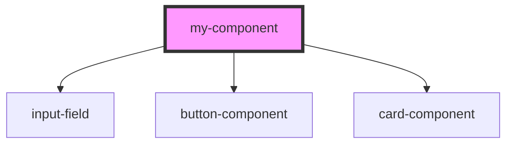

# my-component

<!-- Auto Generated Below -->

## Dependencies

### Depends on

- [input-field](../web-components/input-field)
- [button-component](../web-components/button-component)
- [card-component](../web-components/card-component)

### Graph

----------------------------------------------

*Built with [StencilJS](https://stenciljs.com/)*
