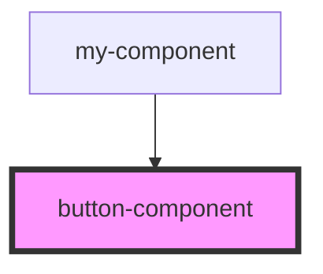

# button-component

<!-- Auto Generated Below -->

## Properties

| Property | Attribute | Description | Type     | Default       |
| -------- | --------- | ----------- | -------- | ------------- |
| `text`   | `text`    |             | `string` | `'Klik hier'` |
| `type`   | `type`    |             | `string` | `'primary'`   |

## Events

| Event           | Description | Type                  |
| --------------- | ----------- | --------------------- |
| `todoCompleted` |             | `CustomEvent<string>` |

## Dependencies

### Used by

 - [my-component](../../my-component)

### Graph

----------------------------------------------

*Built with [StencilJS](https://stenciljs.com/)*
