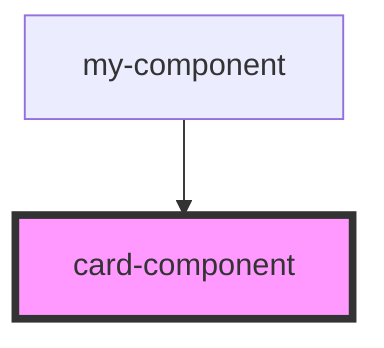

# card-component

<!-- Auto Generated Below -->

## Properties

| Property     | Attribute    | Description | Type       | Default     |
| ------------ | ------------ | ----------- | ---------- | ----------- |
| `index`      | `index`      |             | `number`   | `undefined` |
| `item`       | --           |             | `TodoItem` | `undefined` |
| `removeable` | `removeable` |             | `boolean`  | `false`     |

## Events

| Event        | Description | Type                  |
| ------------ | ----------- | --------------------- |
| `removeTodo` |             | `CustomEvent<number>` |

## Dependencies

### Used by

 - [my-component](../../my-component)

### Graph

----------------------------------------------

*Built with [StencilJS](https://stenciljs.com/)*
