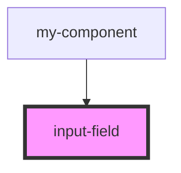

# input-field

<!-- Auto Generated Below -->

## Properties

| Property      | Attribute     | Description | Type     | Default       |
| ------------- | ------------- | ----------- | -------- | ------------- |
| `placeholder` | `placeholder` |             | `string` | `'Vul in...'` |
| `type`        | `type`        |             | `string` | `'text'`      |
| `value`       | `value`       |             | `string` | `undefined`   |

## Events

| Event          | Description | Type                   |
| -------------- | ----------- | ---------------------- |
| `inputCorrect` |             | `CustomEvent<boolean>` |
| `inputUpdated` |             | `CustomEvent<string>`  |

## Dependencies

### Used by

 - [my-component](../../my-component)

### Graph

----------------------------------------------

*Built with [StencilJS](https://stenciljs.com/)*
